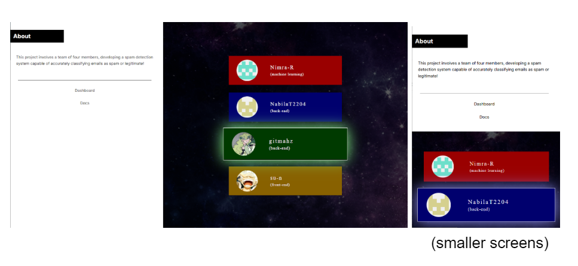
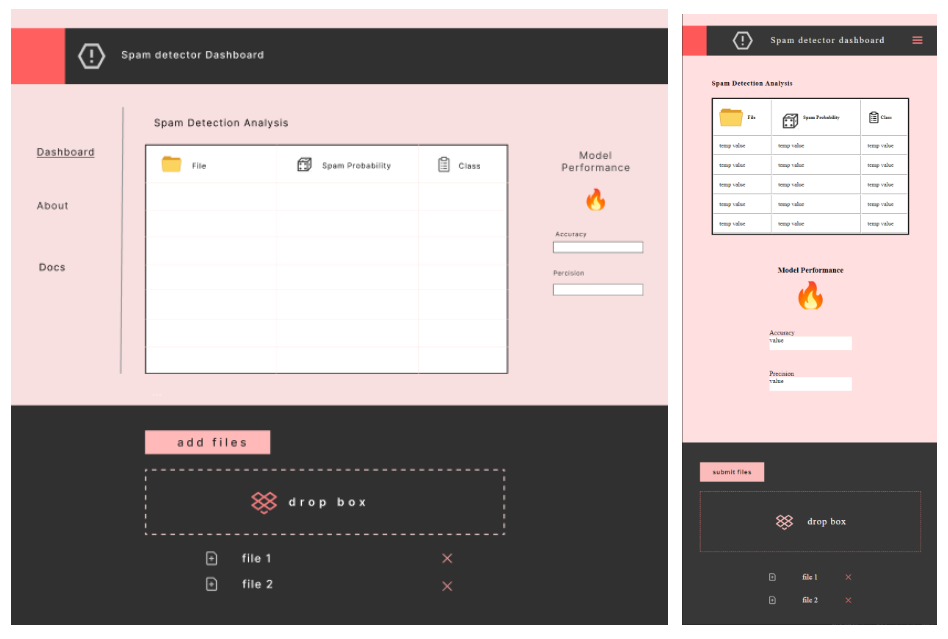

# Documentation of Spam Project

## Front-End

We've made several enhancements to our project, focusing on responsive design and user experience improvements, particularly on the "About Me" page and dashboard. The design now seamlessly adapts to various screen sizes, ensuring a fluid experience across all devices. We've also introduced aesthetic updates to enrich the interface's visual appeal.

Further enhancing the interface, we've integrated a menu with "About" information that comes to life with hover animations, adding a layer of interactivity to the user experience. For usability, the table and layout are resizable on small and large screens.



We've also focused on feedback mechanisms, incorporating an error UI popup that triggers based on the server’s HTTP responses, making it easier for users to understand what went wrong. Finally, the documentation has been added directly into the user interface to guide users on how to use the spam detection feature effectively.



## Back-End

The backend will provide the services and utilities of our spam detector application. It will consist of main functions necessary to distinguish between spam and ham emails, including calculating probability along with accuracy and precision. In other words, it will implement the spam detection algorithm.

### Overview

The `Spam Detector Class` provides a versatile collection of functions designed for analyzing text data to distinguish between spam and ham (non-spam) messages. Below is a breakdown of its functionalities, including input and output descriptions for each method:

- **Spam Detector Class**: Holds the functions necessary for performing frequency calculations and is responsible for reading files from the specified spam and ham folders.

- **readFileContents**:

  - **Input**: Path to a file.
  - **Output**: A list of unique words, case-insensitive.

- **fileFromFolderReader**:

  - **Input**: Path to a folder.
  - **Output**: A list containing the unique words from each file within the given folder.

- **trainHamFreq**:

  - **Input**: Path to the ham folder.
  - **Output**: A map of words to their frequencies, representing the total occurrences of each unique word in the ham files.

- **trainSpamFreq**:

  - **Input**: Path to the spam folder.
  - **Output**: A map of words to their frequencies, indicating how often each unique word appears in the spam files.

- **wordCountinFile**:

  - **Input**: Path to a file.
  - **Output**: The total number of words in the specified file.

- **totalWordCount**:

  - **Input**: Path to a folder.
  - **Output**: The total number of words across all files within the specified folder.

- **calculateWordProbability**:

  - **Input**: Frequencies of words and the total word count.
  - **Output**: A map of words to their probabilities, calculated by dividing each word's frequency by the total word count.

- **probabilityOfSpam**:
  - **Input**: Text data.
  - **Output**: The likelihood of the file being spam, based on calculated probabilities of words in ham and spam datasets.

This class and its methods provide a comprehensive approach to spam detection through detailed textual analysis and probability calculations.

### Spam Resource Class Overview

The `Spam Resource Class` serves as the bridge for putting the `SpamDetector` class into action, facilitating the integration between the backend logic and frontend interfaces of a spam detection web service. Below is an outline of its functionalities and responsibilities:

- **Instance of SpamDetector Class**: Instantiates an object of the `SpamDetector` class to leverage its analytical capabilities.

- **Constructor**:

  - **Purpose**: Initializes the class and loads necessary resources.
  - **Functionality**: Calls the `trainAndTest` method to prepare the class for use.

- **Endpoints**: Provides several web service endpoints for different functionalities:

  - **Spam Results Endpoint**: Creates a service endpoint to fetch spam detection results.
  - **Accuracy Results Endpoint**: Deploys a service endpoint dedicated to retrieving the accuracy of the spam detection process.
  - **Precision Results Endpoint**: Initiates an endpoint for obtaining precision metrics of the detection system.

- **trainAndTest Method**:
  - **Purpose**: Handles the loading of all required directories and their files.
  - **Functionality**: Implements all functions created in the `SpamDetector` class to ensure the system is fully operational and capable of performing spam detection tasks.

## How To Run Project

1. Clone the GitHub Repository

## Improvements for the Future

We could improve our spam-detection model to be more efficient by ignoring common words found in files such as "and", "the", "but", and "has". This would improve the performance of our model as it has fewer words to iterate over to calculate the probability of the file being a spam or legitimate. Furthermore, to increase the accuracy and precision, we can train the model using the user's feedback directly. This feedback would then be custom tailored towards the user's expectation of what spam mail and legitimate mail truly are, resulting in a good user experience.

## Dropbox Functionality (Improvement/Completion)

For the user to interact with our spam detection, we have included a dropbox field where the user can manually drop in their own files to see if they are spam or legitimate. This dropbox will collect the user-inputted files in a `FormData` object located in the JavaScript file in the function `uploadFiles(files)`, which then sends the files to the server using a POST request. The server will then process the files, checking for errors such as "file size too large" or "file failed to be stored" and returning the appropriate response back to the client side. The client then updates the user interface to let the user know the status of the file upload. This would include user interface features such as when the user drops the file, the UI shows which file has been dropped and is staged to be sent to the server.

### Code Example

```javascript
// doc: https://developer.mozilla.org/en-US/docs/Web/API/HTML_Drag_and_Drop_API/File_drag_and_drop

// uploads files to server
function uploadFiles(files) {
  // files is an array that holds individual files
  let url = "/upload";
  // Form Data is used for file uploads
  // doc: https://developer.mozilla.org/en-US/docs/Web/API/FormData
  let formData = new FormData();

  // loop through files array
  for (let i = 0; i < files.length; i++) {
    formData.append("file", files[i]); // appends key: "file" along with the file name
  }

  // send file to server
  postFetchMe(url, formData, (response) => {
    // to fill in
  }).catch((err) => {
    // Handle any error that occurred when sending file to server
    showError(`Error when sending files to server: ${err}`);
  });
}
```
